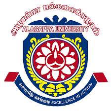

<table  border="none" style="border:0px;border-collapse: collapse;" rules="none" >
	<colgroup>
       	<col span="1" style="width: 8%;">
	<col span="1" style="width: 25%;">
	<col span="1" style="width: 2%;">
       	<col span="1" style="width: 65%;">
	</colgroup>

<tr>
<td> </td>
<td> <b> Project Student </b>   Dec 2024 - May 2025 </td>
<td></td>
<td> 
	

	Supervisor: <a mailto:karthikeyanm@alagappauniversity.ac.in">Prof. Dr. M. Karthikeyan</a>  
 	Lab: <a href="https://mkarthikeyan.bioinfoau.org/">Pharmacogenomics & CADD-Lab</a>   

 	Specifically working on the quality assessment, refinement, and prediction of the 3D structure of RNA macromolecules and associated complexes.

  	

</td>
</tr>

<tr>
<td> </td>
<td> <b> Research Intern </b>   May 2024 - July 2024 </td> 
<td></td>
<td> 

	<a href="https://www.imtech.res.in/">CSIR-Institute of Microbial Technology (IMTECH)</a>, Chandigarh, India  
  
  Supervisor: <a mailto:krishna@imtech.res.in">Dr. Srikrishna Subramanian,</a> Cheif Scientist, Bioinformatics Facility, G.N. Ramachandran Protein Centre  
 	Lab: <a href="https://www.imtech.res.in/contact/staff/dr-srikrishna-subramanian">Big Data Analytics-Lab</a>   
        
	I was the primary instructor and coordinator for a wide range of undergraduate-level theory and practical courses such as:  

<ul>
  <li>Resposibilities Include:</li>
    <li>Analyzed microbial genome data to predict and annotate genes using multiple computational gene prediction tools.</li>
    <li> Explored structural and functional aspects of microbial proteins through protein modeling and sequence analysis.</li>
    <li>Collaborated with researchers to interpret genomic findings and present weekly updates on project progress.</li>
</ul>

</td>
</tr>
</table>
